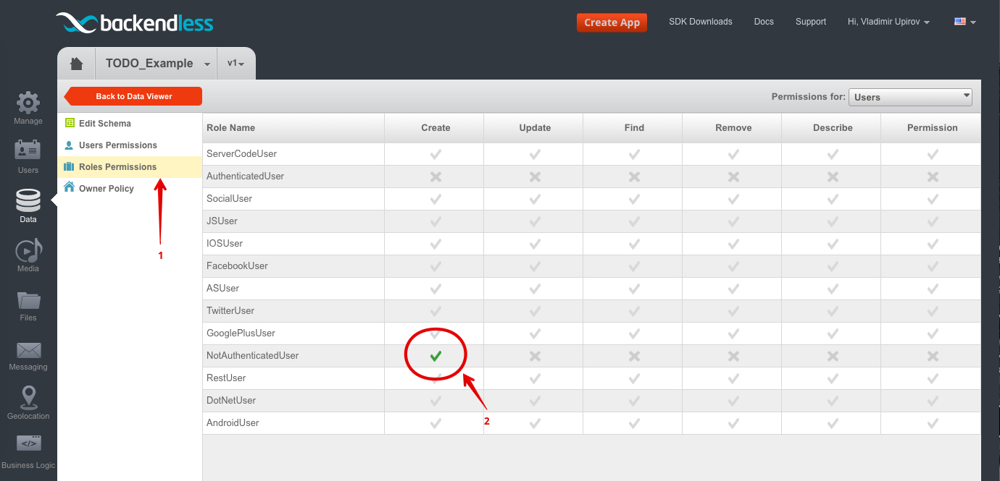
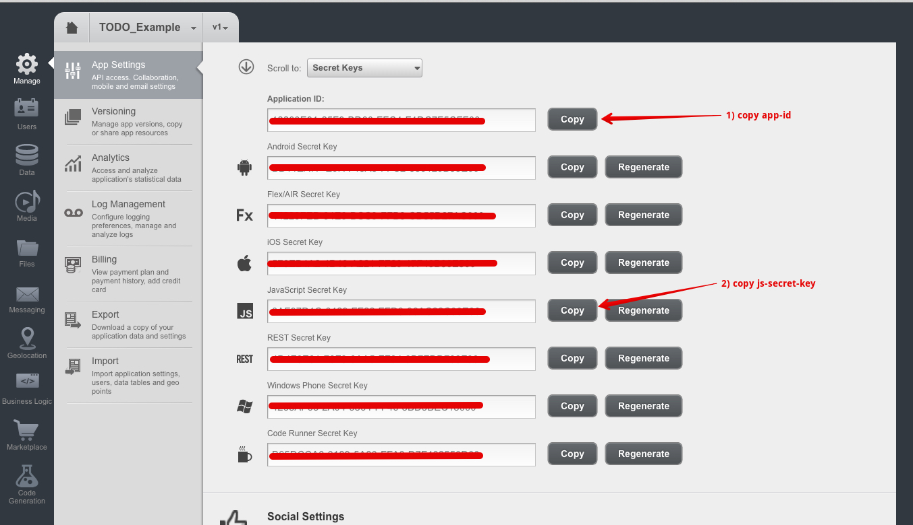

# Backendless & Backbone.js [TodoMVC](http://todomvc.com/examples/backendless-backbone)

> The Backendless Platform is a tightly integrated system designed to streamline and accelerate application development process. Individual platform products can address requirements of developers working on mobile, web-based or enterprise applications. However the platform as a whole establishes a unified approach for building applications faster, at a reduced development cost and with the utmost reliability.

### For convenience we use Backendless [extension](https://github.com/Backendless/Backendless-Backbone) for Backbone.js 

## Resources

- [Website](https://backendless.com/)
- [Backendless Api](https://backendless.com/documentation/users/js/users_overview.htm)
- [Blog](https://backendless.com/blog/)
- [FAQ](http://support.backendless.com/knowledge-base/faqs)

### Articles

- [Backendless & Backbone extension docs](https://github.com/Backendless/Backendless-Backbone)
- [Quick Start Guide](https://backendless.com/mobile-developers/quick-start-guide-for-javascript/)

### Support

- [StackOverflow](http://stackoverflow.com/questions/tagged/backendless)
- [Facebook](https://www.facebook.com/backendless)
- [Twitter](https://twitter.com/Backendless)
- [Google+](https://plus.google.com/+Backendless-mBaaS/posts)
  	
*Let us [know](https://github.com/tastejs/todomvc/issues) if you discover anything worth sharing.*


## Implementation

  - [Backendless config](#backendless-config )  
      - [Setup App](#setup-backendless-app)
      - [User's Permission](#backendless-users-permission)
      - [Create Todo table](#create-todo-table)
      - [Configure Todo table](#configure-todo-table)
      - [Configure Users table](#configure-users-table)
      - [Data Security](#backendless-data-security)
      
  - [Your Application](#your-application)
      - [Install Backendless JS-SDK](#install-backendless-js-sdk)
      - [Init Application](#init-your-application)
      - [User Login](#user-login)
      
  - [Backendless & Backbone.js](#backendless-&-backbone.js)
      - [Install Backendless-Backbone extension](#install-backendless-backbone-extension)
      - [Create Todos Collection Class]()

## Backendless config 

### Setup Backendless App
  
  - The first you need to [register](http://develop.backendless.com/) your Backendless account
  - [Login](https://develop.backendless.com/) to Backendless dev console 
  - Create a new Backendless Application
  
### Backendless User's Permission
Our Application is public and anyone can create a new user and add/remove/change/find own todos.
And we don't want that someone has access to our own items and especially can modify or remove something.
So, for it we need to change default settings of Users Permissions.
For now just go to `Security & Restrictions` and disallow all actions for `AuthenticatedUser` and for `NotAuthenticatedUser`  


   
### Create Todo table

Create a new one Backendless table and call it `Todo`                             


### Configure Todo table

Now when we have `Todo` table let's configure it


How you can see for `AuthenticatedUser` and for `NotAuthenticatedUser` all actions is not allowed
so, we need to allow only `create` a new todo item for `AuthenticatedUser`  


Also I want to mention that owner can `find/modify/remove` by default

 
  
### Configure Users table
 
We want that only `NotAuthenticatedUser` has an ability create a new user, so configure it  

 
And also we don't want that user can remove/modify himself, so let's configure the rule      
     
 
### Backendless Data Security
You can get more information about Backendless Data Security by following [link](https://backendless.com/documentation/data/js/data_security.htm)  
   
   
## Your Application
  - [Install Backendless JS-SDK](#install-backendless-js-sdk)
  - [Init Application](#init-your-application)
  - [User Login](#user-login)
      
### Install Backendless JS-SDK
The first you need to get Backendless JS-SDK, you can do it by a few ways:

  - Download from our [site](https://backendless.com/downloads/) 
  - Download from [Github](https://github.com/Backendless/JS-SDK)
  - Install with [NPM](https://www.npmjs.com/), `npm i backendless --save`
  - Install with [Bower](http://bower.io/), `bower install backendless --save`

Don't forget to include the JS-SDK into your project      
        
### Init Your Application
Now when we have Backendless App and Backendless JS-SDK we need to bind our application with Backendless App.
Go to App Settings section and copy/paste `App ID` and `JavaScript Secret key` into code of your application  


```js 

    Backendless.initApp('xxxx-APP_ID-xxxx', 'xxxx-JS_SECRET_KEY-xxxx', 'v1');

```

But for more readable we moved secret keys into variables
 
```js

    var APP_ID = 'XXXX-XXXX-XXXX-XXXX';
    var JS_SECRET_KEY = 'XXXX-XXXX-XXXX-XXXX';
    var APP_VERSION = 'v1';

    Backendless.initApp(APP_ID, JS_SECRET_KEY, APP_VERSION);

````

That's all what we need to create a new project and start use all of Backendless services like: UserService, DataService, GeoService, MessagingService, FileService etc.

### User Login
Our app works with real data which stored on the server, and each todo item must has an owner, 
so for it we need to register and login a new Backendless User when user open our App the first time.
We register a new User with random __email__ and __password__ and then just login the user.
The code you can see in `app.js` file    
     
## Backendless & Backbone.js 
If you love build application with [Backbone.js](http://backbonejs.org/) the [Backendless-Backbone.js](https://github.com/Backendless/Backendless-Backbone) extension is for you.

### Install Backendless-Backbone extension
  - Download the latest release on [Github](https://github.com/Backendless/Backendless-Backbone/releases).
  - Clone the repository: `git clone https://github.com/Backendless/Backendless-Backbone.git`.
  - Install with [NPM](http://npmjs.org): `npm i backendless-backbone --save`.
  - Install with [Bower](http://bower.io): `bower install backendless-backbone --save`.    

And include the extension into you app 

### Create Todos Collection Class
For start use Backendless with Backbone enough only one thing it's add a `schemaName` into Backbone class
 
```js
 
 var Todos = Backbone.Collection.extend({schemaName: 'Todo'});
 
``` 

That's all, now you can create an instance of Todos collection and do what you want `fetch/create/destroy...` all your changes will be save on the server.

More information about Backendless-Backbone.js extension you can get by fallowing [link](https://github.com/Backendless/Backendless-Backbone)  


## Credit

Created by [Vladimir, Upirov](https://github.com/Valodya)