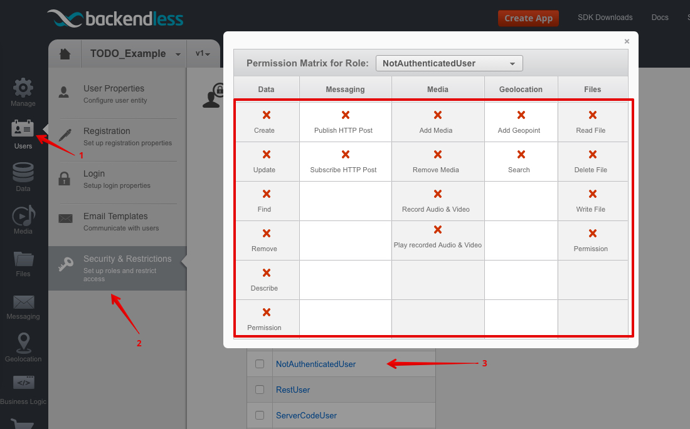
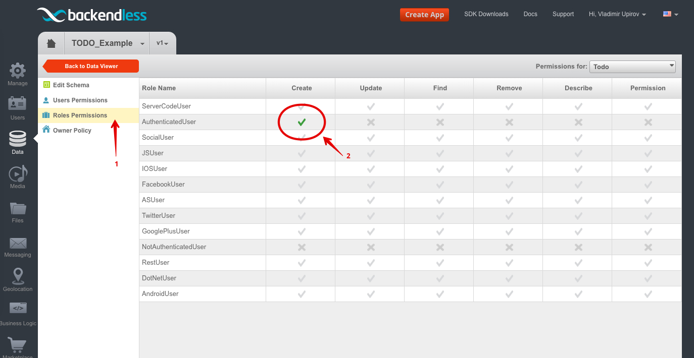
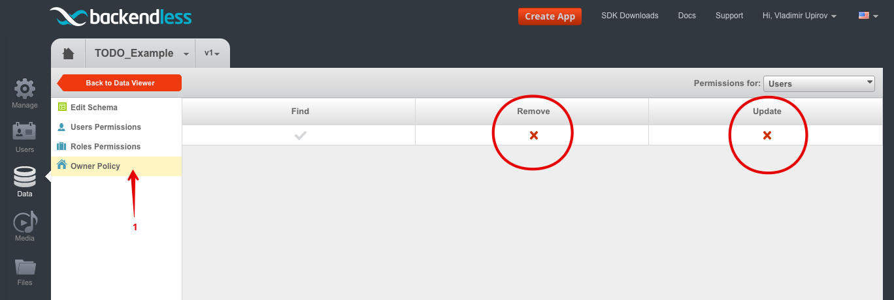

# Backendless • [TodoMVC](http://todomvc.com/examples/backendless)

> Official description of the framework (from its website)


## Resources

- [Website](https://backendless.com/)
- [Documentation](https://backendless.com/documentation/users/js/users_overview.htm)
- [Blog](https://backendless.com/blog/)
- [FAQ](http://support.backendless.com/knowledge-base/faqs)

### Articles

- [Quick Start Guide](https://backendless.com/mobile-developers/quick-start-guide-for-javascript/)

### Support

- [StackOverflow](http://stackoverflow.com/questions/tagged/backendless)
- [Facebook](https://www.facebook.com/backendless)
- [Twitter](https://twitter.com/Backendless)
- [Google+](https://plus.google.com/+Backendless-mBaaS/posts)
  	
*Let us [know](https://github.com/tastejs/todomvc/issues) if you discover anything worth sharing.*

## Implementation

  - [Backendless config](#backendless-config )  
      - [Setup App](#setup-backendless-app)
      - [Init App](#init-backendless-app)
      - [User's Permission](#backendless-users-permission)
      - [Create Todo table](#create-todo-table)
      - [Configure Todo table](#configure-todo-table)
      - [Configure Users table](#configure-users-table)
      - [Data Security](#backendless-data-security)
      
  - [Your Application](#your-application)
      - [Install Backendless JS-SDK](#install-backendless-js-sdk)
      - [Init Application](#init-your-application)
      - [User Login](#user-login)
       

## Backendless config 

### Setup Backendless App
  
  - The first you need to register your Backendless account, you can do it by the [link](http://develop.backendless.com/#registration) if you already have account just skip the step
  - Login to Backendless dev console 
  - Create a new Backendless Application
  
  
### Init Backendless App
Go to App Settings section and copy and paste `App ID` and `JavaScript Secret key` into code of your feature application  


   
   
```js
    
    var APP_ID = 'xxxxx-xxxxx-xxxxx-xxxxx-xxxxx';
    var JS_SECRET_KEY = 'xxxxx-xxxxx-xxxxx-xxxxx-xxxxx';
    var APP_VERSION = 'v1'; 

    Backendless.initApp(APP_ID, JS_SECRET_KEY, APP_VERSION);
```
   
### Backendless User's Permission
Our Application is public and anyone can create a new user and add/remove/change/find own todos.
And we don't want that someone has access to our own items and especially can modify or remove something.
So, for it we need to change default settings of Users Permissions.
For now just go to `Security & Restrictions` and disallow all actions for `AuthenticatedUser` and for `NotAuthenticatedUser`  


   
### Create Todo table

Create a new one Backendless table and call it `Todo`                             


### Configure Todo table

Now when we have `Todo` table let's configure it


How you can see for `AuthenticatedUser` and for `NotAuthenticatedUser` all actions is not allowed
so, we need to allow only `create` a new todo item for `AuthenticatedUser`  


Also I want to mention that owner can `find/modify/remove` by default

 
  
### Configure Users table
 
We want that only `NotAuthenticatedUser` has an ability create a new user, so configure it  

 
And alos we don't want that user can remove/modify himself, so let's configure the rule      
     
 
### Backendless Data Security
You can get more information about Backendless Data Security by following [link](https://backendless.com/documentation/data/js/data_security.htm)  
   
   
## Your Application
   
### Install Backendless JS-SDK
The first you need to get Backendless JS-SDK, you can do it by a few ways:

  - Download from our [site](https://backendless.com/downloads/) 
  - Download from [Github](https://github.com/Backendless/JS-SDK)
  - Install with [NPM](https://www.npmjs.com/), `npm i backendless --save`
  - Install with [Bower](http://bower.io/), 'bower install backendless --save'

Don't forget to include the JS-SDK into your project      
        
### Init Your Application
Now when we have Backendless App and Backendless JS-SDK we need to bind our application with Backendless App, so for it add only one line into our code:

```js 

    Backendless.initApp('xxxx-APP_ID-xxxx', 'xxxx-JS_SECRET_KEY-xxxx', 'v1');

```

But for more readable we move secret keys into variables
 
```js

    var APP_ID = 'XXXX-XXXX-XXXX-XXXX';
    var JS_SECRET_KEY = 'XXXX-XXXX-XXXX-XXXX';
    var APP_VERSION = 'v1';

    Backendless.initApp(APP_ID, JS_SECRET_KEY, APP_VERSION);

````

That's all what we need to create a new project and start use all of Backendless services like: UserService, DataService, GeoService, MessagingService, FileService etc.

### User Login
Our app works with real data which stored on the server, and each todo item must has an owner, 
so for it we need to register and login a new Backendless User when user open our App the first time.
We register a new User with random __username__ and __password__ and then just login the user.
The code you can see in `app.js` file    

## Credit

Created by [Vladimir, Upirov](https://github.com/Valodya)