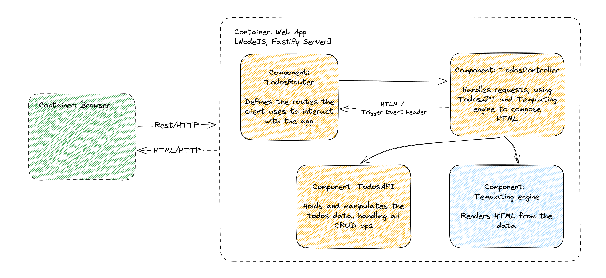

# HTMX TodoMVC

**A simple, feature-complete To-Do application using HTMX**

This project provides a fully functional To-Do list app that leverages [HTMX](https://htmx.org/) to handle front-end interactivity without traditional JavaScript frameworks, instead relying on built-in web standards for optimal performance. This app demonstrates how HTMX can efficiently manage dynamic content with minimal JavaScript.

## Prerequisites
* **NodeJS v20.0.0** (or higher)
* **NPM v9.6.4** (or higher)

If you're using `nvm`, you can run `nvm use` from the HTMX example directory, and `nvm` will manage the Node version for you.

## Getting Started
1. Navigate to the project's directory:
    ```bash
    cd examples/htmx
    ```
2. Install NPM dependencies by running:
    ```bash
    npm install
    ```
3. Start the web server:
    ```bash
    npm run start
    ```

That's it!   
Open your browser and navigate to http://localhost:3000/ to start using the app. Enjoy!


## Architecture

### Tech Stack
* **Server** - [Fastify](https://fastify.dev/)
* **Templating engine** - [EJS](https://ejs.co/)
* **Client** - [HTMX](https://htmx.org/), Plain JavaScript
* **Styling** - Plain CSS

### Web App Container
The server handles most of the application’s "heavy lifting" and consists of 4 main components:
| Component       | Description                                                                 |
| --------------- | --------------------------------------------------------------------------- |
| **TodosRouter** | Defines the routes the client uses to interact with the app      |
| **TodosAPI**    | The "Model" - Holds and manipulates the todos data, handling all CRUD ops   |
| **Templating engine** | The "View" - Renders HTML from the data                               |
| **TodosController**   | The "Controller" - Handles requests, using TodosAPI to compose HTML   |

Below is a diagram showing the relationship between these components:



### Client-Server Communication
All client-server communication uses HTTP requests, following REST principles where possible (e.g., `POST` for creating new todos, `DELETE` for deleting them, `PATCH` for updating them, etc.).

### Application State and Routes
State is managed on the server, so refreshing the page preserves the current application state without relying on local or session storage, making it closer to real-world applications.   
Filtering is achieved through application routing. For instance, if you land on a page with a filter applied, such as `http://localhost:3000/?filter=completed`, the page displays the filtered todo list along with the appropriate footer.

### Swapping Markup
Navigating to `http://localhost:3000` initially fetches the entire application markup. However, after that, any interaction only updates a portion of the page, reducing page refresh flicker.  
The entire application uses [hx-boost](https://htmx.org/attributes/hx-boost/), so even when filtering todos, which navigates to a new `href`, only the relevant markup is fetched, avoiding a full page reload.  
To further optimize performance, [eTag](https://developer.mozilla.org/en-US/docs/Web/HTTP/Headers/ETag) is implemented for Fastify, enabling caching for improved speed.

### Oh, and BTW...
No Webpack, no Babel – none of the usual build tools – just the capabilities provided by modern web standards.

## Developer
In case you would like to tweak this application you will find it convenient to launch the application with [nodemon](https://nodemon.io/). You can do it by running the following command:
```bash
npm run start:dev
```

## Credits

Created by **Matti Bar-Zeev**  
[](https://x.com/mattibarzeev)  
[](https://dev.to/mbarzeev)  
[](https://www.linkedin.com/in/matti-bar-zeev/)  
