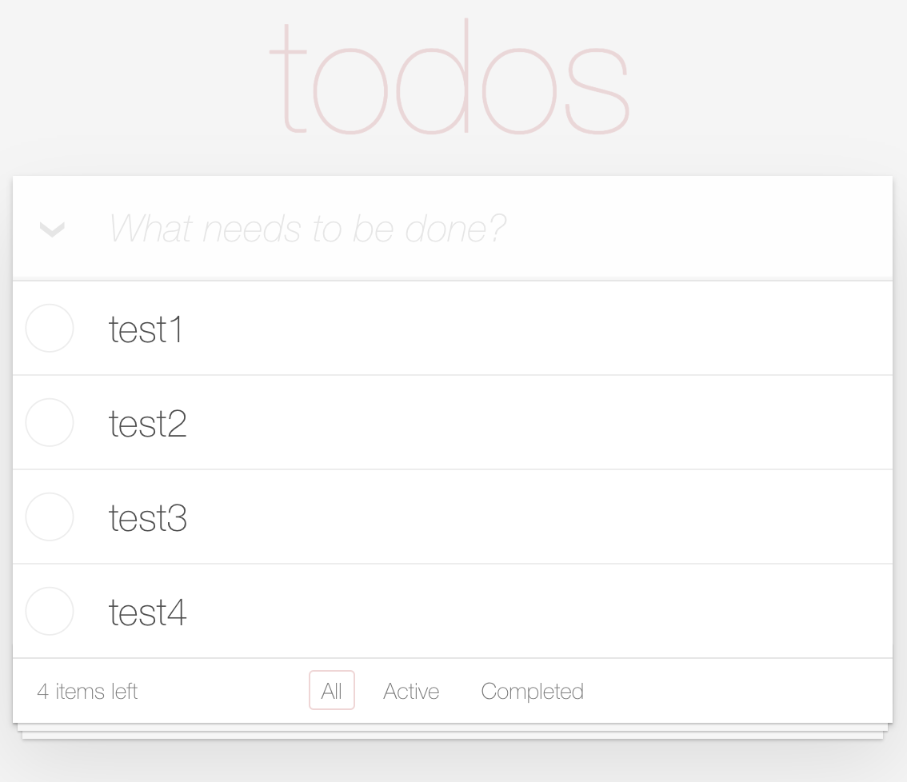
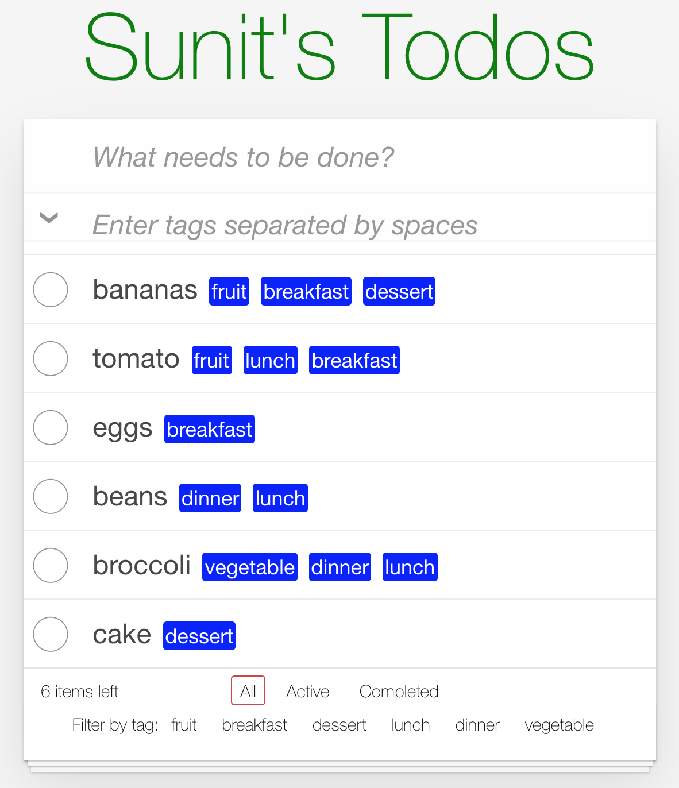

# FOLD Developer Interview Project - todomvc
## Sunit Mody (2021)

## Table of Contents
1. [Description](#description)
2. [Project Template Link](#link)
3. [Getting Started](#getting)
4. [Implemented Feature](#feature)
5. [Highlights](#highlights)
6. [Possible areas of improvement](#improvements)
7. [Technologies](#techs)

<a name="description"/>

## Project Description
- This is a modification to an existing todoMVC repo created using React

<a name="link"/>

## Project Template Link
- The orignal repo that I modified:
- https://github.com/tastejs/todomvc/tree/gh-pages/examples/react
- Original application hosted on internet:
- https://todomvc.com/examples/react/#/

<a name="getting"/>

## Getting Started
- Fork and clone repo to your local enviornment

- From within the root directory ~/todomvc/examples/react
```
$ npm install
```

- Start gulp server on port 8000
```
$ npm start
```

- View app locally in browser
```
http://localhost:8000/examples/react/#/
```

<a name="feature"/>

## Implemented Feature
- The feature I added was the functionality to add multiple tags to each todo item that is created. The tags are visible next to each todo item. The user is able to filter through the todos and display them by selecting one or multiple tags. The user can also remove an already selected tag (for filtering) by clicking on it again. Lastly the user can click "Clear tags filter" to completely remove all tag filters.





<a name="highlights"/>

## Highlights
- Added CSS styling (including flex-box) to make tags easily visible. Also added a different color hover highlighting of tags to differentiate from active vs completed filters.

- Used array methods (higher-order functions) such as .map, .filter, and .some to modify arrays to help with state management.

- Managed filtering of todos by tags using a click-handler to modify state. This is compared to the existing filtering logic of active vs completed todos which uses the URL's endpoint and routing to modify state.

<a name="improvements"/>

## Possible areas of improvement

- Update React and JS syntax to ES6 and/or use React Hooks

- Add abiltiy to edit or remove existing tags

- Highlight selected tags so it's easy to see which tags are currently being used to filter the todos with

- Create a separate component for "tag" and maybe "tagInput" for better separation of concerns

- Clean up styling to be able to handle numerous tags without cluttering the footer component

<a name="techs"/>

## Technologies

Highlighted Technologies:
- React
- Gulp
- Javascript


<!-- # Sunit's Implementation

- Fork and clone repo

- run: npm install --global gulp-cli

- updated devDependencies in root directory to "gulp": "^4.0.0",

- run: npm install

- Updated gulp to latest version 4.0.2

- Modified gulpfile in root directory to use gulp.series() (modfication required because old code was deprecated)

- Run: npm start to start gulp test-server on port 8000 (localhost:8000)

- Click "react" which will take you to: http://localhost:8000/examples/react/#/

- CSS modified at ~/react/node_modules/todomvc-app-css/index.css

- If you're getting issues try clearing the browser's local storage object (that's where the todo's are being saved) using: localStorage.clear(); in the console

# Notes/Ideas for adding tags feature

- in todoModel.js add a "tags" property to the todos object when they are created. tags: ["funny", "green", "etc"]

- in app.jsx use the shownTodos variable to filter based on tag (currently filtering based on completed or not)

## Possible areas of improvement

- Update React syntax to ES6 or use React Hooks

- Add abiltiy to edit or remove existing tags

- Add multiple tags per todo item (separated by commas or spaces)

- Create a separate component for "tag" and maybe "tagInput" for better separation of concerns

- Add ability to filter on multiple tags simultaneously -->

<!--
# React TodoMVC Example

> React is a JavaScript library for creating user interfaces. Its core principles are declarative code, efficiency, and flexibility. Simply specify what your component looks like and React will keep it up-to-date when the underlying data changes.

> _[React - facebook.github.io/react](http://facebook.github.io/react)_


## Learning React

The [React getting started documentation](http://facebook.github.io/react/docs/getting-started.html) is a great way to get started.

Here are some links you may find helpful:

* [Documentation](http://facebook.github.io/react/docs/getting-started.html)
* [API Reference](http://facebook.github.io/react/docs/reference.html)
* [Blog](http://facebook.github.io/react/blog/)
* [React on GitHub](https://github.com/facebook/react)
* [Support](http://facebook.github.io/react/support.html)

Articles and guides from the community:

* [How is Facebook's React JavaScript library](http://www.quora.com/React-JS-Library/How-is-Facebooks-React-JavaScript-library)
* [React: Under the hood](http://www.quora.com/Pete-Hunt/Posts/React-Under-the-Hood)

Get help from other React users:

* [React on StackOverflow](http://stackoverflow.com/questions/tagged/reactjs)
* [Discussion Forum](https://discuss.reactjs.org/)

_If you have other helpful links to share, or find any of the links above no longer work, please [let us know](https://github.com/tastejs/todomvc/issues)._


## Running

The app is built with [JSX](http://facebook.github.io/react/docs/jsx-in-depth.html) and compiled at runtime for a lighter and more fun code reading experience. As stated in the link, JSX is not mandatory.

To run the app, spin up an HTTP server (e.g. `python -m SimpleHTTPServer`) and visit http://localhost/.../myexample/. -->