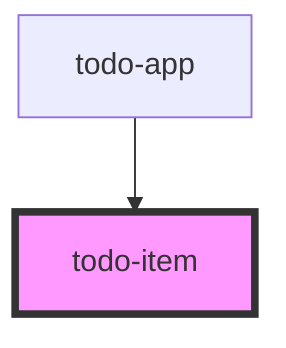

# todo-app

<!-- Auto Generated Below -->

## Properties

| Property  | Attribute | Description | Type            | Default     |
| --------- | --------- | ----------- | --------------- | ----------- |
| `editing` | `editing` |             | `boolean`       | `undefined` |
| `todo`    | --        |             | `TodoItemModel` | `undefined` |

## Events

| Event     | Description | Type                                             |
| --------- | ----------- | ------------------------------------------------ |
| `cancel`  |             | `CustomEvent<void>`                              |
| `destroy` |             | `CustomEvent<string>`                            |
| `edit`    |             | `CustomEvent<string>`                            |
| `save`    |             | `CustomEvent<{ todoId: string; text: string; }>` |
| `toggle`  |             | `CustomEvent<string>`                            |

## Dependencies

### Used by

 - [todo-app](.)

### Graph

----------------------------------------------

*Built with [StencilJS](https://stenciljs.com/)*
