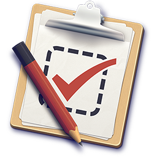

# 

> Helping you select an MV\* framework

### [Website](http://todomvc.com)&nbsp;&nbsp;&nbsp;&nbsp;[Blog](http://blog.tastejs.com)&nbsp;&nbsp;&nbsp;&nbsp;[TasteJS](http://tastejs.com)

Developers these days are spoiled with choice when it comes to selecting an MV\* framework for structuring and organizing JavaScript web apps.

Backbone, Ember, AngularJS... the list of new and stable solutions goes on and on, but just how do you decide on which to use in a sea of so many options?

To help solve this problem, we created TodoMVC - a project which offers the same Todo application implemented using MV* concepts in most of the popular JavaScript MV\* frameworks of today.

## View & Run in Web IDE

Click on the button below to view the code in a Web IDE. Feel free to edit the code and then run it all from your browser.

## Team

TodoMVC would not be possible without a strong team of [contributors](https://github.com/tastejs/todomvc/contributors) helping push the project forward each day. In addition, we have a core project team composed of:

#### [Addy Osmani](http://github.com/addyosmani) - Founder/Lead

Addy is a Developer Platform Engineer at Google who originally created TodoMVC. He oversees the project direction, drives expansion and helps lead core development with Sindre Sorhus (by far our most active contributor!).

#### [Sindre Sorhus](https://github.com/sindresorhus) - Lead Developer

Sindre is a Web Developer who drives core development, quality control and application design for the project. His contributions have helped us ensure consistency and best practices are enforced wherever possible.

#### [Pascal Hartig](https://github.com/passy) - Developer

Pascal is a Software Engineer at Twitter with a deep passion for consistency. He watches pull requests and helps developers getting their contributions integrated with TodoMVC.

#### [Stephen Sawchuk](https://github.com/stephenplusplus) - Developer

Stephen is a Front-end Engineer at Quicken Loans that cares about improving the maintainability and developer experience of open-source projects. His recent contributions include helping us move all apps over to using Bower and implementing the new information bar.

#### [Colin Eberhardt](https://github.com/colineberhardt) - Developer

Colin is a software consultant at Scott Logic who is passionate about all software - from JavaScript to Java, and C# to Objective-C. His recent contribution to the project has been a fully automated test suite.

#### [Gianni Chiappetta](https://github.com/gf3) - Logo designer

Gianni is a programmer and designer currently working as the Chief Rigger at MetaLab.

## Disclaimer

TodoMVC has been called many things including the 'Speed-dating' and 'Rosetta Stone' of MV\* frameworks. Whilst we hope that this project is able to offer assistance in deciding what frameworks are worth spending more time looking at, remember that the Todo application offers a limited view of what a framework may be capable of.

It is meant to be used as a gateway to reviewing how a basic application using a framework may be structured and we heavily recommend investing time researching a solution in more depth before opting to use it.

## Getting Involved

Whilst we enjoy implementing and improving existing Todo apps, we're always interested in speaking to framework authors (and users) wishing to share Todo app implementations in their framework/solution of choice.

Check out our [contribution docs](contributing.md) for more info.

## License

Everything in this repo is MIT License unless otherwise specified.

MIT © Addy Osmani, Sindre Sorhus, Pascal Hartig, Stephen Sawchuk.
